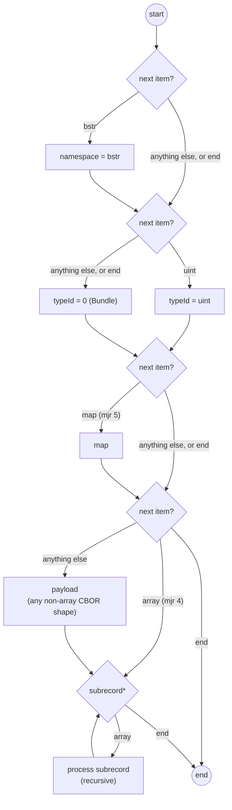

<!--
AUTO-GENERATED by scripts/sync-qdef-spec.sh -- do not hand-edit.
Mirrors https://raw.githubusercontent.com/qdef-format/qdef-format.github.io/main/docs/QDEF-SPEC.md (main branch). Re-run the script to refresh;
changes made directly to this file will be overwritten next sync.
-->

# QDEF — Quick Data Exchange Format

**Status: Draft — work in progress. The wire format is settled and
validated by two prototypes — a Node round-trip prototype covering the
full design (`/prototype`) and a `no_std`, zero-dependency Rust prototype
of the mandatory core (`/rust/qdef-core`), which also builds for a bare-metal
Cortex-M0 target; but there is no reference library and no production use
yet. This document is normative; the reasoning behind its decisions —
mechanisms tried and removed, alternatives weighed, and what's still
unresolved — lives in [DESIGN.md](DESIGN.md).**

QDEF is a general-purpose binary container for multi-action 2D barcodes
(QR, Data Matrix, Aztec) and NFC tags. Think of it as filling the gap NDEF
already fills for NFC — "here are one or more typed records in one
tap/scan" — but for the byte-mode payload of an optical code, or for an NFC
payload with no existing MIME type doing the routing. No equivalent exists
today: text barcode schemas (`WIFI:S:...;;`, `BEGIN:VCARD`) are rigid,
single-purpose, and text-only; NDEF solves multi-record framing but only
for NFC.

Without a format field to dispatch on, a general-purpose QR reader has no
choice but to *guess* what a scanned payload is — by sniffing prefixes, a
list that only grows and never gets more reliable. NDEF sidestepped this
for NFC decades ago with its MIME-type/TNF field; QR never had the
equivalent. QDEF's magic header plus prefix-based Type-ID routing (§3)
gives byte-mode QR that same explicit, extensible dispatch.

QDEF is meant to be adopted by unrelated applications with no shared
history — a Wi-Fi provisioning sticker, an event ticket, a passphrase-
protected key backup spread across several printed codes (worked example in
§7) are all equally valid uses. It is not tied to, and does not assume
familiarity with, any particular application.

## 1. Abstract & Philosophy

QDEF is binary-first: an extensible, multi-action CBOR payload, parseable
both by a modern smartphone and by a deeply constrained embedded scanner
(transit gate, POS terminal) with only a minimal CBOR decoder — no
semantic-tag support, no compression library, nothing beyond reading maps,
uints, and strings.

QDEF is deliberately two things, not one:

- A minimal **core format** (§3): magic framing, a self-delimited root
  Record, prefix-based Type-ID routing, and a per-key criticality
  rule. A parser that only implements this can route or skip any Record
  without knowing anything else about it.
- A separate, optional **standard library** (§4): reusable building blocks
  (splitting a payload across multiple codes, compression, encryption, a
  generic fallback) that any application can pull in without writing its
  own reassembly, cipher, or fallback-routing code.

Neither layer is optional to the *design* — see §4 for why a minimal
implementer must never be forced to bring a compression or reassembly
library just to route Records.

### When QDEF earns its place

Any application that already defines its own text/URI scheme (human-
typable, clickable — `myapp://...`) should encode its envelope directly
under that scheme, not wrap it in QDEF. The scheme prefix already does the
recognition job QDEF's magic header exists for (§2); wrapping adds only
redundant bytes with nothing to show for them. QDEF earns its place on
carriers with **no pre-existing dispatch**: plain byte-mode QR with no URI
at all, or an NDEF payload with no app-specific MIME type already routing
it. §7's PGP-key-backup example is exactly this case — those codes are only
ever scanned by one app, never clicked or typed, so there's no scheme to
lean on instead.

## 2. Container Wire Format

8-bit byte mode only — never alphanumeric; text-safety is explicitly not a
goal. A 4-byte magic header (4 bytes total, no version byte) for instant
optical-stream validation, followed directly by the **root Record** —
one self-delimited CBOR array (major type 4), the exact same shape as
any subrecord (§3.1), holding that Record's own
`namespace?`/`typeId?`/`map?`/`payload?`/`subrecord*` items. Self-
delimiting the root this way means any bytes appended after the
container are unambiguously outside it, by construction — no
end-of-buffer guesswork, no marker needed.

```
+----------------------+----------------------------------------------+
|   Magic (4 bytes)     |     Root Record, one CBOR array (§3.1)        |
+----------------------+----------------------------------------------+
| 0x51 0x44 0x45 0x46   |  [ namespace?, typeId?, map?, payload?, sub* ]|
|       "QDEF"          |  (self-delimited; anything after it is       |
|                        |   provably outside the container)            |
+----------------------+----------------------------------------------+
```

typeId is optional, defaulting to `0` (Bundle) when no uint is found at
that position — a forgiving-parser choice, not an error case (§3.1).
This means the root can take either shape, and an encoder picks whichever
matches what the container actually holds:

- **A single primary Record** (e.g. one Wi-Fi credential, one Media
  Payload) — write its own `typeId`/`map`/`payload` directly as the
  root array's items. No Bundle indirection:
  ```
  QDEF [100, {0: "SSID", 2: "pass"}]   -- one Record, typeId 100, at the root
  ```
- **Several co-equal top-level Records** (none subordinate to any
  other) — omit the root's typeId, letting it default to `0`, and give
  each one as a further element of the root array; they become the
  root's subrecords:
  ```
  QDEF [[100, {...}], [10, {...}]]     -- two Records, subrecords of the
                                        --   implicit root Bundle
  ```

Both the root array and every subrecord's own array header (its CBOR
element count) are what bound them — a decoder can always skip a whole
Record generically, using nothing but ordinary CBOR array-skipping,
without any Record-grammar knowledge at all.

For NFC, the magic prefix is redundant: NDEF's own MIME-type field already
identifies the payload. An NDEF record carrying QDEF content uses MIME type
`application/vnd.qdef` with the root Record's own self-delimited array as
the payload, no magic bytes.

**The same applies to an application carrying QDEF content under its own
URI scheme** (§1's "When QDEF earns its place"): the scheme prefix
(`myapp:...`) already identifies the payload, so the remainder is the
same self-delimited root array with no magic, decoded via the same
`decodeSequence` path. See DESIGN.md for why this also affects
even-Type-ID collision safety on that carrier (§3.5).

**No version byte.** §3.2's even/odd criticality rule already provides
local forward compatibility; see [DESIGN.md](DESIGN.md#container-framing-choices)
for why an earlier draft's version byte was removed.

**No record count or total payload size in the header.** The root
Record's own CBOR array is self-delimiting; see
[DESIGN.md](DESIGN.md#container-framing-choices) for why these fields
were deliberately left out.

## 3. The Record Architecture

Every Record is exactly one definite-length CBOR array:
`[namespace?, typeId, map?, payload?, subrecord*]`. Using a Wi-Fi Record
(Type `100`, see [EXAMPLES.md](EXAMPLES.md)) as the example (this is
where §3.2's even/odd rule applies):

```
Record: [ 100, { 0: "My Coffee Shop", 2: "guest123", 4: 2, 1: true } ]

Map:
+-----+------------------------+-------+----------+-----------------------------+
| Key | Value                  | Type  | Even/Odd | If unrecognized             |
+-----+------------------------+-------+----------+-----------------------------+
| 0   | "My Coffee Shop"       | text  | even     | CRITICAL: abort Record      |
| 2   | "guest123"             | text  | even     | CRITICAL: abort Record      |
| 4   | 2                      | uint  | even     | CRITICAL: abort Record      |
| 1   | true                   | bool  | odd      | OPTIONAL: silently ignored  |
+-----+------------------------+-------+----------+-----------------------------+
```

Every Record — a plain content Record like this one or a standard record
type Wrapper Record (§4.1) — has exactly this shape: its own array,
holding an optional namespace, a typeID, an optional field Map, an
optional payload, and zero or more subrecords. Field values may be any
well-formed CBOR item now, not just scalars and strings (§3.2) — the
"never needs recursion" property §3.3 describes still holds, just via a
bounded explicit stack (the same one already used to skip unrecognized
prefix items) rather than a shape restriction.

The parser first determines this Record's total byte span generically —
skipping its whole array as one well-formed CBOR item, independent of
whether the array's own contents turn out to be valid Record grammar —
then walks that bounded span with a two-phase loop to find the Record's
own structure within it: Phase 1 recognizes the Record's optional
namespace and its single typeID-bearing item. Phase 2 checks the very
next item: a Map (major type 5) is always the field Map, full stop —
nothing else in the grammar is ever map-shaped, so there is no padding
to skip in search of one. Whatever remains after that (or immediately
after typeId, if no Map), if it is not itself an array, is the payload,
of any other well-formed CBOR shape (§3.2). An array in this position is
never a payload — it always means "no payload, subrecords begin here" —
so there is nothing to disambiguate a decoder needs a marker for.
Everything after the payload (or, if no payload, everything from that
first array onward) is subrecords (§3.1). Because the Record's total
span is already known before this walk begins, a Record whose own
contents fail to parse as valid grammar still cannot corrupt discovery
of the next sibling Record — only Record grammar within the
(already-known-well-formed) span is uncertain, never where that span
ends.

### 3.1 The Record array: namespace, Type ID, Map, Payload, and subrecords

Every Record is exactly one item list, in order: an optional namespace,
an optional typeID-bearing item, an optional field Map (omitted when
empty — saves one byte per record with no fields), an optional payload
(any well-formed CBOR item except an array — §3.1's payload paragraph
below), and zero or more subrecords, always wrapped in an explicit,
definite-length CBOR array (major type 4) — self-bounded, so a decoder
can always skip one generically. The **root** (§2) is this exact same
array shape too: there is no separate grammar for "a Record at the
container root" — this one, reused, self-delimiting the container the
same way a subrecord self-delimits itself inside a larger item list.

```
namespace?, typeId?, map?, payload?, subrecord*
```

The record's five slots, laid out as a flowchart:



Semantics: the decoder checks, in order, at most one item for namespace,
at most one item for typeId, then (if anything remains) exactly one
more:
- If the current item is a **byte string** (major 2): consume it as the
  **namespace**, unconditionally — there is no requirement that a valid
  typeId immediately follow it (deliberately dropped; see DESIGN.md).
- If the current item (after any namespace) is a **uint** (major 0):
  consume it as the **typeId**. If it is not a uint — including if
  nothing remains at all — the typeId defaults to `0` (Bundle): a
  forgiving-parser choice, not an error case (see DESIGN.md). There is
  no other state; a decoder never needs to reject a Record for "having
  no typeId."
- If the next item is a **map** (major 5): consume it as the field Map.
  Nothing else in the grammar is ever map-shaped, so this check needs
  no lookahead or padding-skipping — major type 5 here always means
  "field Map," unconditionally.
- Whatever remains after that (or immediately after typeId, if no map
  was found): if it is an **array** (major 4), there is no payload and
  this array is subrecord 0. Otherwise, it is the **payload**, of any
  other well-formed CBOR shape — the same shape rule a field value has
  (§3.2), minus arrays. If nothing remains at all, there is no payload.
- Everything remaining after the payload is **subrecords**.

A subrecord whose own array header is at least well-formed CBOR is
always generically isolable — any decoder can skip a whole subrecord it
doesn't care about using nothing but ordinary CBOR array-skipping, with
no Record-grammar knowledge at all. There is no backup-typeID mechanism
and no decentralized (byte string) or Named (text string) Type ID form.
See DESIGN.md and FINDINGS.md for why these were retired, why every
subrecord became array-wrapped, and why the container-level
discriminator collapsed into this same grammar once typeId became
optional.

**Namespace.** The current item is a namespace (a byte string, the only
valid Namespace ID shape) whenever it's present, full stop — no
lookahead pairing required. When present, it scopes this Record's own
typeId, overriding whatever ambient namespace this Record inherited
(§3.5) for this one Record (and, by cascade, its own subrecords) only —
a purely local override; every sibling Record is unaffected.

```
[ h'a9d6e1f30b7c4482', 1, { ... } ]    // this Record's own namespace,
                                        //   paired with a scoped typeID
```

An even `typeId` alongside a namespace is vacuous — even uints are
always globally interpreted regardless of any declared namespace
(§3.5), unconditionally. A namespace only affects an odd (scoped)
typeId.

A namespace is paid fresh on every Record that carries one, root or
not — a subrecord happy with whatever ambient namespace it inherited
should omit it. See DESIGN.md's "Multiple namespaces per container" for
the byte-cost comparison.

**A namespace-shaped item with no real namespace intended needs an
explicit typeId ahead of it.** Because a byte string is unconditionally
read as namespace, a Record whose payload happens to be byte-string-
shaped, with no namespace and no explicit typeId, would otherwise have
that payload misread as a namespace. Write the typeId explicitly (even
`0`) to keep the byte string in the payload position instead of the
namespace position — the one real cost of dropping the pairing
requirement (see DESIGN.md).

**Type ID.** A typeID-bearing item is optional: a bare uint (major type
0), consumed whenever the current position holds one. No other major
type is valid there — a byte string, text string, or array in this
position is never recognized as a typeId. Absent, the typeId defaults
to `0` (Bundle) — see DESIGN.md for why this forgiving-parser choice
was made instead of treating a missing typeId as an error.

The typeID's parity determines its classification:

```
+------------------+-------------------+------------------+-----------------------+
| typeID CBOR type | Classification    | Scope            | Meaning               |
+------------------+-------------------+------------------+-----------------------+
| uint, even       | Standard record   | Always global    | Registered standard   |
|                  | type              |                  | mechanism or content  |
|                  |                   |                  | type                  |
+------------------+-------------------+------------------+-----------------------+
| uint, odd        | Scoped record     | Namespace-       | REQUIRES a declared   |
|                  | type              | scoped           | namespace (§3.5);     |
|                  |                   |                  | absent namespace,     |
|                  |                   |                  | Record MUST abort     |
+------------------+-------------------+------------------+-----------------------+
```

Even uints are always globally interpreted regardless of any declared
namespace, so standard record type mechanisms (§4) work unconditionally
inside any namespaced container. Odd uints require a declared namespace;
without one, the Record MUST abort.

**Even/odd vocabulary reuse note.** §3.2's even/odd also governs map
*keys* (critical vs. optional) — a distinct axis from typeID *value*
parity here; the two never overlap.

**Implementer caution for uint Type IDs:** a uint Type ID MUST be
encoded as a native CBOR uint (major type 0), never wrapped in a bignum
tag (CBOR tag `2`/`3`). Verify your specific encoder does this, not just
that some CBOR library is present. See FINDINGS.md #14.

**Payload.** Immediately following the optional field Map (or following
typeId when no Map is present), a Record MAY carry exactly one payload.
**A conformant encoder MUST emit only a byte string or a text string**
here — not a scalar, a map, a tag, or any other CBOR shape (narrowed
from an earlier, broader rule; see DESIGN.md and FINDINGS.md for the
real bug that motivated it). A text-string payload is assumed to be
plaintext — a decoder may infer a media type (e.g. `text/plain`) at its
discretion — a byte-string payload is opaque, its meaning described by
the Record's own field Map. A decoder MAY still recognize any other
non-array CBOR shape found in this position (the same shape rule an
ordinary field value has, §3.2, minus major type 4) for forward
compatibility with bytes from an encoder that predates this rule or
doesn't follow it — but a conformant encoder never produces one.
Arrays are excluded specifically so that an array immediately after the
Map (or typeId) is always unambiguously the start of subrecords, never
a payload — no marker or lookahead needed to tell the two apart. Absent,
it costs nothing.

```
[ 8, h'<deflate bytes>' ]             // typeID 8, payload (byte string)
[ 20, { 0: "image/png" }, 'hello' ]   // typeID 20, map, payload (plain text)
```

The payload slot exists for wrapper records (§4.1) and for content that
the decoder reads and passes through without interpreting. To attach
another Record, use a subrecord (§3.1's Subrecords paragraph below) —
payload can never itself be a nested Record (see DESIGN.md for why this
was tried and reverted).

**A payload REQUIRES a nonzero typeId — a Bundle (typeId `0`) MUST NOT
carry a payload.** Flat and unconditional, not merely "when it would
actually collide": a byte-string payload with no real typeId on the
wire is indistinguishable from a leading namespace, so a conformant
encoder never puts the two together, regardless of whether a namespace
happens to also be present in that particular case (see DESIGN.md).
This is the one remaining collision once map- and scalar-shaped
payloads are excluded; every other payload shape is disambiguated by
position and cardinality alone.

> **Note:** this costs nothing Bundle ever had a defined use for.
> Bundle (§4.6) is structural — its meaning is entirely in its
> subrecords, and its own field Map is namespace metadata only, never
> application content (§4.6). A payload would have been an undefined
> fourth content channel alongside that. A Record that genuinely wants
> both a namespace and an opaque payload attached still can — give it
> any nonzero typeId instead of `0`; nothing becomes unrepresentable,
> it's just no longer spelled "Bundle."

**A conformant encoder MUST emit the payload as a definite-length CBOR
item** — §3.4's canonical-encoding requirement already implies this. An
indefinite-length item in this position is still well-formed CBOR a
decoder MUST be able to skip generically, but a decoder MAY treat it as
though no payload were present (falling through to subrecord-scanning,
§3.1, where it is then skipped again as a non-array item) rather than
recognizing it as this Record's payload — the same decoder-side
tolerance §3.2 already permits for indefinite-length field values. Both
shipped prototypes are conformant here despite disagreeing:
`rust/qdef-core` never recognizes an indefinite-length payload
candidate, while the Node prototype does (its underlying `cbor` library
normalizes indefinite-length strings before application code ever sees
them). Only a conformant encoder's own output — always definite-length —
is required to round-trip identically everywhere.

**Subrecords.** Every array element following the payload (or following
the map when no payload is present, or following typeId when neither map
nor payload is present) is itself a nested Record, recursively the same
`namespace?, typeId?, map?, payload?, subrecord*` grammar defined in
this section, wrapped in its own explicit, self-delimited array — there
is no separate grammar for "a Record when it's nested" or "a Record at
the container root" (§2): this one, reused, every instance the exact
same self-delimited CBOR array.

```
[ 20,
  { 0: "image/png", 3: "map.png" },
  [ 2, { 0: h'<group_id>', 2: 0, 4: 3 }, h'<fragment>' ]
]
```

Each subrecord dispatches independently by its own typeID, exactly like
a top-level sibling Record — never by position or array index.

**Implementer caution for subrecords.** A subrecord's own contents
failing to decode cleanly (a CBOR-level malformation, e.g. a truncated
string or a mismatched indefinite-string chunk type) MUST NOT prevent a
decoder from continuing to the next sibling — of the parent Record or
of the subrecord itself — since each Record's total byte span is
already known, via generic array-skipping, before its contents are
interpreted (see §3's parser description). There is no longer a
"doesn't parse as valid Record grammar" failure mode to guard against
separately: typeId/namespace/map/payload are all optional or
defaulting, so any well-formed array parses as *some* valid Record.

### 3.2 The Extensibility Rule (Even/Odd Keys)

Borrowed from PNG's critical/ancillary chunk convention. Note: this even/odd
rule applies to *map keys* only, not to a typeID prefix item's *value* —
see §3.1 for the even/odd classification of Type ID values, which is a
separate convention on a separate axis.

- **Even keys are CRITICAL.** An unrecognized even-numbered key MUST cause
  the parser to abort processing *that record* (not the whole container —
  sibling records sharing the same array are unaffected).
- **Odd keys are OPTIONAL.** An unrecognized odd-numbered key MUST be
  silently ignored; the rest of the record still processes normally.

This gives per-field forward compatibility: a future critical field doesn't
require any version-bump mechanism, only choosing an even key
number the current Record Type doesn't yet define.

**This rule applies uniformly to negative keys too** — parity is
well-defined on any integer, and a negative key isn't a special case
requiring different treatment. §3.6 defines a spec-governed, Type-
independent vocabulary that lives entirely in the negative-key space for
exactly this reason.

**A Record field's value MAY be any well-formed CBOR item** — a scalar,
a string, or a nested array, map, or tag of any depth. See DESIGN.md
and FINDINGS.md for why the earlier flat-scalar-only restriction was
dropped.

```
7: [1, 6, 11]                     // a bare array (major type 4)
```

Pre-encoding structured content as an opaque byte string is still
legal, and still useful when an outer decoder should skip it without a
generic CBOR library:

```
7: h'8301060b'                    // pre-encoded [1, 6, 11], opaque to a
                                   //   decoder that skips it
```

**Skip-safety.** `skip_any_item` (the mandatory core's generic "skip any
well-formed CBOR item" function) walks containers of any shape with a
bounded explicit stack, never the call stack — the same mechanism
already used for unrecognized prefix items. Nesting depth is bounded by
each decoder's own practical limit, an implementation detail, not part
of this spec's wire contract.

**Advisory, not required.** Encoders SHOULD NOT produce field values
nested more deeply than genuinely useful content needs. Decoders MAY
enforce their own depth limit and reject anything deeper.

**Indefinite-length items are legal in field values for decoders to
accept, never for conformant encoders to produce** — §3.4's
canonical-encoding requirement (definite-length forms only) is
unchanged for encoders; this is decoder-side tolerance only.

**Precondition on "the whole stream is unaffected":** this isolation
guarantee assumes the Record's own array is at least well-formed CBOR —
a parser needs the array's byte length to find where the next Record
starts, and determines that length generically (skipping the whole
array as one item) before attempting to interpret what's inside it
(§3.1). A Record that fails to route (no typeID, §3.1) or whose own
contents otherwise fail to parse as valid Record grammar is still
well-formed CBOR and isolable this way — only that one Record is
affected, never its siblings. A Record whose own array is not even
well-formed CBOR (including a malformed indefinite-length chunk
sequence within it) is a stronger failure: the parser cannot determine
that boundary at all and cannot safely resume scanning for further
siblings.

### 3.3 Conformance Levels

QDEF is designed so a minimal, generic parser is genuinely minimal — no
implementer has to bring a compression library or sector-reassembly logic
just to support the *container*:

- **Core QDEF parser (mandatory, all implementers):** verify magic, parse
  the root Record as one self-delimited CBOR array (§3.1/§2 — no
  separate discriminator to skip or interpret), read its typeID (and
  its subrecords' typeIDs, recursively) to route or skip, apply the
  even/odd rule (§3.2) to unrecognized keys. That's the entire surface
  area — no compression, no multi-code state, no knowledge of any
  specific Record Type's fields.
- **Record-Type-specific handling (optional, per Record Type an implementer
  chooses to support):** everything else — including whether a given
  Record Type's payload happens to be compressed, or happens to require
  reassembling several codes — is defined *by that Record Type*, not by
  QDEF. An implementer who only cares about Wi-Fi provisioning (Type 100)
  never has to read, understand, or link against whatever some other
  registered Record Type does internally.

A conformant core parser never needs *true* recursion: every subrecord
is exactly one array, `namespace? → typeID? → Map? → Payload? →
subrecord*`, and skipping any well-formed CBOR item at any
depth — an unrecognized field, a whole unrecognized subrecord, or a whole
subrecord's worth of its own subrecords — uses a bounded explicit stack
instead of the call stack. A subrecord's own total byte span is always
determined this same generic way, before any attempt to interpret its
contents. Validated in [`rust/qdef-core`](../rust/qdef-core); see
FINDINGS.md for the mechanism (`skip_any_item`).

### 3.4 Canonical Encoding

**Encoders MUST produce CBOR meeting RFC 8949 §4.2.1's core deterministic
encoding requirements** for every Record: the shortest-form argument for
every integer, length, and tag; no indefinite-length items; and every
Record Map's keys sorted in bytewise lexicographic order of their own
encoded bytes. QDEF doesn't define a new canonical-encoding rule — it
adopts CBOR's own, unchanged.

This is a requirement on *encoders*, not decoders: a decoder MUST NOT
reject an otherwise well-formed Record merely for being non-canonically
encoded (key order never affects whether `map[N]` is findable). The rule
exists so that anywhere QDEF hashes a Record's bytes for content-
addressing (§4.1's `group_id`, and any future Sign mechanism, §8), two
independent encoders handed identical field values compute the same
hash — otherwise semantically-identical content could hash differently
across encoders. See DESIGN.md for the full reasoning.

Not a new implementation burden in practice: most CBOR encoders already
default to shortest-form arguments and definite-length items. The one
requirement needing explicit encoder discipline is map key ordering —
cheap, since Record Maps are small by construction.

### 3.5 Namespace Declaration and Scoping

There is no separate container-level discriminator item anymore — a
namespace is declared exactly the same way for the container root as
for any subrecord: the ordinary namespace-pairing prefix (§3.1), a byte
string recognized unconditionally at the front of a Record's own item
list. The root's own namespace (if any) cascades to its subrecords the
same way any Record's does, doing the job a separate discriminator item
used to (see DESIGN.md and FINDINGS.md for why the two collapsed into
one mechanism once typeId became optional). A namespace ID is always a
byte string — there is no uint (Allocated) namespace tier. See
DESIGN.md for why.

```
QDEF [100, {...}]                              // no namespace: typeId 100 at the root directly

QDEF [h'a9d6e1f30b7c4482', [100, {...}]]       // root namespace, no content of its own --
                                                //   typeId defaults to 0 (Bundle), the Record
                                                //   is its one subrecord

QDEF [h'a9d6e1f30b7c4482', {3: "com.example/tagdrop-paper"}, [100, {...}]]
                                                // root namespace + hint (Bundle's own map,
                                                //   §4.6) + one content subrecord
```

A recoverable **hint** name for a namespace, and a second, differently-
sized **backup namespace** for a length-promotion transition, are
ordinary keys (`3` and `5` respectively) in whatever Record's field Map
carries the namespace — Bundle's, §4.6, when the root itself defaults
to Bundle because it has no primary content of its own. Both are
odd/optional: a decoder that doesn't recognize them ignores them, never
aborts. There is no dedicated shape or slot for either beyond this —
the same even/odd extensibility (§3.2) every Record's own field Map
already relies on.

**A hint on a namespace ID is always self-certifying, since a namespace
ID is always a byte string.** The Hint name plays the
self-certifying strengthening role the hash-derivation algorithm below
describes: anyone examining a QDEF container found in the wild, with no
registry or external lookup, can both read the namespace's name off the
wire and verify it matches the namespace bytes.

**Byte-length guidance:** self-allocate freely at **4 bytes or longer**
— collision safety comes from the byte length alone, and stays
comfortable into the tens of thousands of independently self-chosen
namespaces. **Shorter than 4 bytes is reserved, not self-allocatable**
— collision risk at those widths is real even against a small,
uncoordinated population, so a namespace this short is only safe with
its uniqueness guaranteed by direct coordination. See DESIGN.md for the
collision math this floor is grounded in.

**Hash-derivation algorithm**, for any self-certifying byte string value
this spec calls for (namespace IDs here, and App Route's hash-derived
form, §4.4 — a general-purpose primitive, not tied to Type IDs):

```
digest = SHA-256(UTF-8(name))
N      = developer-chosen byte length (4+ for namespace IDs, per the
         byte-length guidance above)
Value  = digest[0..N] as a definite-length CBOR byte string (major type 2)
```

Verification is opportunistic — no version marker records whether a
value used this convention; if the hash matches, the binding is
confirmed, otherwise the Hint name is just a plain, unverified label.

**A name feeding hash-derivation SHOULD be qualified by something the
namer actually, verifiably controls** — a reverse-domain string
(`"com.example.tagdrop"`, not bare `"tagdrop"`), the same convention
Java packages, XML namespaces, and MIME subtypes use, so the derived
value behaves like a random draw rather than a likely collision with
another implementer's bare-word choice. See DESIGN.md for why an
unqualified name produces a certain, not probabilistic, collision.

Prototyped in `prototype/src/header.js`'s `verifyNamespaceHint`. See
FINDINGS.md #21 for a real verification bug this pinned algorithm fixed.

**No dedicated version field.** Whatever Record's map carries a
namespace's hint/backup keys is already fully extensible — a future
incompatible addition is a new even/critical key in it, using the same
even/odd extensibility (§3.2) every Record's own field Map already
relies on.

**What a declared namespace changes.** Even uint Type IDs always stay
globally interpreted regardless of any declared namespace — standard
record type mechanisms (§4) and registered content types keep working
unconditionally inside any namespaced container.

**Odd uint Type IDs become namespace-scoped once a namespace is
declared.** When a namespace-pairing prefix declares namespace `N` —
whether on the root or on some ancestor Record whose scope this Record
inherited — a Record's odd Type ID `T` is looked up as the compound key
`(N, T)`, not the bare value `T` — the same pattern as a Bluetooth
short UUID paired with its Base UUID. A Record MAY instead lead its own
array with a different namespace inline (§3.1), overriding whatever it
inherited for that one Record only.

**Odd uint Type ID with no declared namespace MUST cause the Record to
abort** — there is no collision-safety source without one.

**A namespace cascades to subrecords.** A subrecord (§3.1) with no
namespace of its own resolves against its *immediate parent's* own
effective namespace (the parent's own override, if it declared one,
otherwise whatever it inherited), not directly against the container's
ambient one — recursively, at any nesting depth. A Record that leads
its own array with a namespace therefore scopes its own subrecords too,
without each one needing to repeat the same declaration.

**Correctness obligation on any decoder implementing namespace-scoped
semantics:** it MUST check for a declared namespace before applying its
interpretation, and MUST NOT fall back to a global reading merely
because it doesn't recognize the specific `(namespace, TypeID)` pair —
that pair is simply unrecognized, never silently reinterpreted as the
global meaning of the same number.

**MUST repeat, identically, on every physical code of a multi-code
group whenever that group carries any namespace-scoped (odd uint) Type
ID** — whether the scoped Type ID belongs to a plain sibling Record or
is only reachable after a Wrapper stack (§4.1) resolves. Each physical
code is parsed independently, from a blank slate, with no cross-code
state; a decoder holding only one code has no way to learn a namespace
declared on another. Split's XOR parity does not protect a code's root
namespace itself (only fragment bytes), so a namespace declared on a
single code is a genuine single point of failure the Split-protected
content does not otherwise share.

**Fully additive, no migration forced.** An app with an existing even
uint Type ID keeps it working forever, namespaced container or not.
Adopting namespace-scoped odd uint IDs for new content is an
independent, opt-in choice.

**Recommended pattern for an isolated-carrier application** — one whose
own URI scheme or NDEF MIME type already isolates it from other
QDEF-aware decoders (§2): namespace-scoped odd Type IDs with the
namespace *implied* by the carrier, never transmitted, rather than a
self-allocated even ID. This costs nothing more than the even-ID
pattern but fails *closed* if the same bytes ever reach an unisolated
carrier (an odd Type ID with no namespace present is a spec-mandated
abort), instead of silently misinterpreting the ID. The implied
namespace value MUST be identical across every one of the application's
own carriers. See DESIGN.md for the byte-cost comparison.

**Caution: carrier isolation is a property of the point of consumption,
not of the bytes themselves.** "Isolated" and "unisolated" byte
sequences are bit-for-bit identical. An implementer reusing identical
CBOR-sequence bytes across multiple carriers MUST verify *every*
carrier those bytes can reach provides isolation, not just the primary
one — a future carrier added without an equivalently exclusive dispatch
mechanism silently reintroduces full collision exposure for every even
Type ID already in use.

Prototyped end to end in `prototype/src/header.js`,
`prototype/src/wrappers.js`'s `resolveStack`, and cross-validated
against `rust/qdef-core` (needs no namespace-specific code at all — the
positional prefix is already part of the one generic Record grammar).
See `prototype/test/header.test.js` and
`prototype/test/multi-code-namespace.test.js`.

### 3.6 Common Field Keys

Every ordinary map key (§3.2) is owned by that Record's own Type — key
`0` means something different in a Wi-Fi Record than in a Media Payload
Record, and a decoder needs Type-specific knowledge to know which. A
**Common Field Key** is the opposite: a negative integer key whose
meaning is fixed by this spec, identically, in *any* Record's field Map
regardless of Type — the same class of vocabulary CBOR Web Token's
common claims (RFC 8392) or COSE's header parameters are for their own
formats. A generic tool (a QDEF debugger, a search index) can render a
Common Field Key the same way in every Record it sees, without knowing
anything else about that Record's Type.

```
[ 100, { 0: "SSID", 2: "pass", 4: 2, -1: h'<id bytes>' } ]
  //                                  ^^ Common Field Key (any Type's map)
```

**Governed by this spec document alone, never self-allocatable by an
application** — unlike the `100`–`32767` Type ID tier. An
application-invented negative key would break the one property this
tier exists for: consistent, Type-independent recognition. Future
additions to this tier follow the same Standards-Action model as Wrapper
Type IDs (§4's `0`–`22` tier) — this document's own publication is the
authoritative declaration.

**Subject to the same even/odd criticality rule as any other map key
(§3.2), unmodified.** Parity is computed on the key's actual
mathematical value, not on its CBOR encoding or its sign: `-1` and `-3`
are odd (optional; unrecognized, silently ignored), `-2` and `-4` are
even (critical; unrecognized, abort that Record) — exactly the same
rule already applied to positive keys. A decoder needs no new mechanism
to support this tier, only to stop treating negative keys as a special
case.

**Implementer caution: a CBOR major-type-1 (negative integer) item's
actual value is `-1 - argument`, not the raw encoded argument** (RFC
8949 §3.1). Computing parity directly on the raw argument gives the
*inverse* of the correct answer — argument `0` (value `-1`) is odd,
argument `1` (value `-2`) is even. A decoder MUST convert to the actual
value before checking parity, not assume the argument's own parity
carries over.

**Starter registry.** All entries are odd (optional) — descriptive or
correlating metadata, never load-bearing for a Type's own function, so
an old decoder that predates any of these stays fully functional:

```
+------+-----------------+--------------------------------------------+
| Key  | Name            | Value shape                                 |
+------+-----------------+--------------------------------------------+
|  -1  | ID              | bstr or tstr -- an NDEF-ID-equivalent       |
|      |                 | correlation token: two Records sharing the |
|      |                 | same value are linked, no further meaning  |
|      |                 | or uniqueness guarantee implied            |
|  -3  | UUID            | bstr, exactly 16 bytes -- a standard,       |
|      |                 | globally-unique RFC 4122/9562 UUID,        |
|      |                 | binary form only (no canonical-text        |
|      |                 | variant: the dashed 36-byte string is      |
|      |                 | display-only, never the wire form)         |
|  -5  | Date            | CBOR tag 0 (RFC 3339 text) or tag 1 (epoch  |
|      |                 | number) -- reuses CBOR's own date tags,    |
|      |                 | no new format                              |
|  -7  | Label           | tstr -- human-readable label                |
|  -9  | Language        | tstr, BCP 47 -- language tag for whatever   |
|      |                 | human-readable text this Record carries    |
|      |                 | (its own Label if present, or a Type's     |
|      |                 | own text field)                            |
| -11  | Content Hash    | bstr, multihash-style: a 1-byte hash-      |
|      |                 | function code (multiformats multicodec     |
|      |                 | table) followed by the digest, length      |
|      |                 | inferred from the byte string itself --    |
|      |                 | identical shape to §4.5's Media Preview    |
|      |                 | key `1`, generalized to any Record         |
| -13  | Source          | tstr -- a URL this content was              |
|      |                 | captured/mirrored from (provenance, not    |
|      |                 | a correlation token -- orthogonal to ID)   |
| -15  | Filename        | tstr -- the original/machine-facing        |
|      |                 | filename, distinct from Label's            |
|      |                 | human-facing display name                  |
+------+-----------------+--------------------------------------------+
```

**ID vs. UUID: two different jobs, not two shapes of the same field.**
ID is for correlating Records *within* the same scan/tap — cheap,
scoped, no uniqueness requirement, the direct equivalent of NDEF's own
`ID` field. UUID is a stronger, standardized identifier meant to survive
outside the container entirely — tracking a specific piece of content
across scans, sessions, or systems. A Record MAY carry either, both, or
neither.

**Filename vs. Label: machine-facing vs. human-facing, not the same
field twice.** Filename is the original name a file or capture already
had ("IMG_2043.jpg"); Label is a human-authored display name ("Beach
sunset"). Plenty of content wants both independently — a Record MAY
carry either, both, or neither, the same as ID and UUID.

**A Type's own key `0` and the common `ID` key (`-1`) can never
collide**, on the wire or in a decoder's own key-lookup logic — CBOR's
major-type distinction between non-negative (major 0) and negative
(major 1) integers keeps the two key spaces disjoint.

**A Type's own field takes precedence for that Type's own purpose.**
Open/Hint URI's key `1` label (§4.2) and App Route's key `1` label
(§4.4) stay exactly as specified; Common Field Key `-7` is additional,
optional metadata a Record MAY also carry, not a replacement for either
Type's own field.

**Byte cost is the same as adding any other field** — one map entry, no
new grammar.

Prototyped in `prototype/src/commonKeys.js` and
`prototype/test/common-keys.test.js`; the criticality-rule reuse cross-
validated against `rust/qdef-core`'s `check_criticality`.

## 4. The QDEF Standard Record Types

QDEF is a *format plus a set of standard record types*, not just the
format — the same relationship C-the-language has with libc. §3 defines
a minimal core any conformant parser must implement, and says nothing
about compression, splitting, encryption, or graceful degradation for
scanners that don't understand a given Record Type. Those live here
instead: a small, curated set of Record Types any application can pull
in — writing no reassembly code, no cipher code, no fallback-routing
code of its own.

**Notation.** Throughout this section, `Type N: { ... }` is shorthand
for that Record Type's own array (§3.1): `[N, { ... }]`, or
`[namespace, N, { ... }]` when namespace-scoped. The brace-only form is
used here purely for readability; the wire shape is always the full
array. When the field Map is empty or absent, `{}` is omitted from
the shorthand entirely — `Type N: [sub]` means `[N, [sub]]` on the
wire (typeId with a subrecord and no fields).

**Standard record type IDs:** even numbers `2`–`98` are reserved for
these standard record types, maintained alongside the QDEF spec itself.
Even numbers `100` and above are open for applications to register their
own domain-specific Record Types ([EXAMPLES.md](EXAMPLES.md)) — who governs *that*
allocation is still open (§8), but at least the two registries are
partitioned by construction and can't collide.

**Currently assigned Type IDs**, each defined in full in its own
subsection below:

```
+------+------------------+---------+---------------------------------+
| ID   | Record Type      | Section | Notes                          |
+------+------------------+---------+---------------------------------+
|  0   | Bundle           | §4.6    | Structural grouping — see §4.6  |
|  2   | Split            | §4.1    | Fragment reassembly / parity    |
|  4   | Encrypt          | §4.1    | AEAD (e.g. AES-256-GCM)         |
|  6   | Media Payload    | §4.3    | Typed binary content            |
|  8   | Compress         | §4.1    | DEFLATE                         |
| 10   | Open/Hint URI    | §4.2    | URI to open, or a fallback for  |
|      |                  |         | unaware readers                 |
| 12   | App Route        | §4.4    | Application dispatch/routing    |
| 14   | Media Preview    | §4.5    | Content identification + body   |
|      |                  |         | subrecord                       |
| 16   | Signature        | §4.7    | Detached authenticity, sibling  |
|      |                  |         | form, positional coverage       |
+------+------------------+---------+---------------------------------+
```

All nine sit in the `0`–`22` Standards Action tier — this spec document's
own publication is the authoritative declaration for them, independent
of whether a registry authority exists yet. An adopter's own pick in
the `100`–`32767` tier is different: provisional until a review
authority exists, since nothing in this document declares what any
specific number in that range means.

**Type ID allocation ranges** (adapted from CBOR's tag registry pattern,
RFC 8949 §9.2):

```
+----------------+----------+----------------------------------------------+
| Range          | Even/Odd | Purpose & governance                         |
+----------------+----------+----------------------------------------------+
| 0–22           | even     | Standards Action — Wrapper Records and other  |
|                |          | standard record type infrastructure,         |
|                |          | spec-maintained                              |
| 24–98          | even     | Specification Required — standard record     |
|                |          | types reserved for future use                |
| 100–32767      | even     | Specification Required — common vocabulary,  |
|                |          | reviewed application-specific types          |
| 32768+         | even     | First Come First Served — self-allocated     |
| odd uints      | odd      | Namespace-scoped only (§3.5) — requires      |
|                |          | declared namespace, abort otherwise          |
+----------------+----------+----------------------------------------------+
```

Each tier's collision-safety comes from curation (reviewed before
granting: Standards Action, Specification Required) or recording
(tracked first-come, no review: First Come First Served). No registry
authority exists today for any uint tier — see DESIGN.md. Namespace IDs
(§3.5) use a third source, self-certification from byte length alone,
but that's a namespace-layer property, not a Type ID tier.

**Choosing a Type ID form.** Three mechanisms sit above, each solving
collision-safety a different way. Work through these questions in
order; stop at the first `YES`:

```
1. Is this part of QDEF's own standard-record-type infrastructure
   (a Wrapper Record or similar mechanism, not application content)?
     YES -> even uint 0-22 (Standards Action, spec-maintained -- not
            something an application ever picks for itself)

2. Do you want this Type eventually recognized by unrelated
   implementers, even though no registry exists yet (§8)?
     YES -> even uint 100-32767 (Specification Required / common
            vocabulary). Ship now with an illustrative number -- there
            is no cheaper provisional-placeholder mechanism anymore
            (no backup typeID promotion path), so pick the number you
            intend to keep.

3. Does your application already have -- or are you willing to
   declare -- a namespace (self-chosen; §3.5 has no Allocated/uint
   namespace tier, so this is always a byte string you pick yourself)?
     YES -> a small sequential odd uint (1, 3, 5...) inside that
            namespace. The cheapest option (as little as 1 byte), and
            if your carrier already isolates you (own URI scheme, own
            NDEF MIME type), the namespace itself can be implied by
            that carrier and never transmitted at all (§3.5) -- so
            this option is usually available "for free" even without
            wanting to pay for an explicit namespace declaration.
     NO  -> a self-allocated even uint, 32768+ (First Come First
            Served) -- but only if your carrier already isolates you
            (own URI scheme, own NDEF MIME type) and you're accepting
            that its safety is carrier-dependent (§3.5's caution)
            rather than declaring a namespace after all (re-read the
            YES branch first -- the implied-namespace pattern costs
            the same and is strictly safer).
```

Most application Record Types resolve at step 3's `YES` branch — a
declared namespace, implied or explicit, with small sequential odd
uints inside it. See DESIGN.md and FINDINGS.md #29/#30/#36.

### 4.1 Wrapper Records (optional)

A **Wrapper Record** is an ordinary Record — same routing, same even/odd
rule — using a reserved low Type ID, whose payload is not application data
but the *encoded bytes of another Record* (which may itself be a Wrapper
Record, nested). Unwrapping and re-parsing the result as a Record is the
entire mechanism: no new parsing concept beyond "run the Record parser
again on these bytes." A single generic resolver — reassemble fragments /
decompress / decrypt, then re-parse as a Record, repeat until the result
isn't a Wrapper Record anymore — implements this for every Record Type
that opts in, with zero code written by that Record Type's own author
(demonstrated in `prototype/src/wrappers.js`'s `resolveStack`).

Wrapper Type IDs, authoritatively assigned by this spec document itself
(Standards Action, `0`–`22` — see the note above the Type ID allocation
table on why that tier needs no separate registry to be real):

```
Type 2:                      // Split
  // prefix typeID: 2
  // field map:
  0: h'<group_id>',          // CRITICAL: content-addressed (a hash of the
                              //   full reassembled bytes) — never an issued
                              //   serial, so no coordination is needed
                              //   between independent encoders (relies on
                              //   §3.4's canonical-encoding rule to actually
                              //   hold across more than one encoder). A
                              //   decoder MUST recompute this hash after
                              //   reassembly and reject a mismatch — it
                              //   doubles as the group's integrity check.
  2: 1,                      // CRITICAL: this fragment's index
  4: 4,                      // CRITICAL: total fragment count in the group
  7: 5821,                   // OPTIONAL as a key (odd), but MUST be present
                              //   whenever key 9 (parity_scheme) is set —
                              //   see chunking rule below. When present:
                              //   total_bytes of the reassembled whole.
  9: 1                       // OPTIONAL: parity_scheme — 0/absent = none,
                              //   nonzero selects a registered forward-
                              //   error-correction scheme so the group
                              //   tolerates a missing/damaged code.
  // payload:
  h'<fragment bytes>'        // this code's slice, in the payload slot

Type 8:                      // Compress (DEFLATE)
  // prefix typeID: 8
  // payload:
  h'<deflate bytes>'         // deflated bytes, in the payload slot

Type 4:                      // Encrypt (e.g. AES-GCM)
  // prefix typeID: 4
  // field map:
  0: h'<nonce>',             // CRITICAL
  3: 3,                      // OPTIONAL: Algorithm — 3 = A256GCM
  5: -25                     // OPTIONAL: Key Algorithm — -25 = ECDH-ES+HKDF-256
  // payload:
  h'<ciphertext+tag>'        // ciphertext concatenated with the 16-byte
                              //   GCM authentication tag, in the payload slot
```

**Keys `3` (Algorithm) and `5` (Key Algorithm)** are each a uint or a
text string, an encoder's choice:

- **A uint** is a [COSE Algorithm
  ID](https://www.iana.org/assignments/cose/cose.xhtml) (RFC 9053/9054),
  covering both content encryption algorithms (`1`/`2`/`3` =
  A128GCM/A192GCM/A256GCM) and key-agreement/wrap/derivation algorithms
  (`-25` = ECDH-ES+HKDF-256; `-10` = direct+HKDF-SHA-256; `-5` = A256KW)
  — negative integers included, permitted by §3.2.
- **A text string** names the algorithm directly for anything not
  registered there.

Both keys are odd/optional: absent, a decoder falls back to whatever
algorithm it already assumed, which fails safely either way since
AEAD's own authentication tag check catches a wrong-algorithm or
wrong-key attempt.

**A decoder that does honor key `3`/`5` MUST NOT let them broaden which
algorithms it's willing to run** — the same "alg" confusion class of
vulnerability JOSE/JWT is known for. Treat the field as a hint to check
against an application-chosen allowlist, never as an instruction to
trust outright.

**Encrypt cannot provide deniability — a scope boundary, not a gap.**
Being wrapped in a Type-`4` Record at all is itself a visible
declaration to any QDEF-aware parser, since Type ID routing (§3.1)
happens unconditionally before any per-Record-Type logic runs. An
application needing ciphertext indistinguishable from random should
keep its own encryption entirely inside an opaque registered blob (§5)
instead. See FINDINGS.md #13.

**Fragment chunking (Type 2).** The spec must fix *how* the original bytes
are sliced, not just what fields describe the result, or two independent
encoders/decoders can't agree on wire bytes. Fixed rule:

```
chunkLen = ceil(total_bytes / count)
fragment[i] = bytes[i * chunkLen .. min((i + 1) * chunkLen, total_bytes)]
```

the last fragment is shorter than `chunkLen` when `total_bytes` isn't an
exact multiple of `count`. This uniform-chunking rule is what makes
`parity_scheme`'s XOR-style recovery well-defined (every fragment
zero-padded to `chunkLen` before XOR). Splitting a group across
different-capacity physical codes with different-sized fragments while
still supporting parity recovery is not yet resolved — see §8.

`parity_scheme` mechanics: a parity fragment (index ≥ `count`, present
only when `parity_scheme` is set) is pure bonus redundancy — plain
reassembly only ever requires fragments `0` through `count − 1`. A
decoder that doesn't understand `parity_scheme` can ignore any fragment
past `count` and still reassemble correctly, losing only resilience,
never correctness. `parity_scheme = 1` (prototype-defined only): a
single XOR parity fragment, recovering exactly one missing/damaged
fragment.

**Fixed nesting order** when more than one Wrapper is combined: `Split
(outermost, if present) → Encrypt → Compress → plain inner Record`.
Compress-before-encrypt is the only sound order (ciphertext doesn't
meaningfully compress); Split-outermost is recommended for efficiency
but **not structurally required, and a decoder cannot detect or reject
a different order** — the generic resolver has no notion of "correct"
order. See FINDINGS.md #7.

**Why a wrapper, not a reserved key range on the inner record itself:**
wrapping avoids a cross-record correctness hazard. See DESIGN.md.

**Cost:** wrapper framing is added per code on top of the inner record,
so this stays strictly opt-in — a Record Type with no need for it stays
a plain, unwrapped Record.

### 4.2 Open/Hint URI (optional)

Unlike §4.1, this is deliberately **not** a wrapper — a plain standard record type Record
Type meant to sit as a *sibling* alongside real content records in the same
array, carrying a URI any generic tool can follow if it doesn't
understand anything else in the container. It's not exclusively a
fallback: the identical Record is also the right choice for a QR code
whose *entire* content is a single URI, with nothing else to fall back
from.

```
Type 10: {                         // Open/Hint URI (standard record type)
  // prefix typeID: 10
  // field map:
  0: "https://example.com/open-this",  // CRITICAL: a URI a generic tool
                                        //   or browser can follow
  1: "Open in MyApp",                   // OPTIONAL: human-readable label
  3: "en",                              // OPTIONAL: BCP 47 language tag
                                         //   for key 1's label
  5: 0                                  // OPTIONAL: suggested action --
                                         //   0 = perform the action (open
                                         //   the URI), 1 = save for later,
                                         //   2 = open for editing
}
```

This is what gives a QDEF container the "something useful happens even
without the specific app" property. It **must** stay a plain sibling
record, never nested inside a Wrapper — a Wrapper's opaque payload
would hide it from a parser that understands nothing else in the
container.

**Keys `3` and `5`** are odd/optional (§3.2): key `3` a BCP 47 language
tag for key `1`'s label, key `5` a suggested action (`0` = perform the
action, `1` = save for later, `2` = open for editing). A decoder that
doesn't recognize either still gets a fully working URI and label. See
DESIGN.md for why these mirror NDEF Smart Poster's own fields.

**Multiple languages or URIs need no new mechanism** — repeat Open/Hint
URI as an ordinary sibling Record, once per variant. Nothing in QDEF
restricts how many Records of the same Type appear in one array.

### 4.3 Media Payload (optional)

A plain standard record type Record Type — not a wrapper — for attaching a standard,
already-widely-recognized media type (a JPEG thumbnail, a vCard, a PDF
snippet) without registering a bespoke Type ID for every possible file
format the way [EXAMPLES.md](EXAMPLES.md) does for application-specific content:

```
Type 6:                          // Media Payload (standard record type)
  // prefix typeID: 6
  // field map:
  0: 22,                         // CRITICAL: Media Type — uint or text,
                                  //   see below (22 = image/jpeg)
  // payload:
  h'<payload bytes>'             // the content itself, in the payload slot
```

**Key `0` (Media Type) may be a uint or a text string** — an encoder's
choice, and a decoder MUST accept either shape:

- **A uint in `0`–`65535`** is a [CoAP Content-Format
  ID](https://www.iana.org/assignments/core-parameters/core-parameters.xhtml)
  (RFC 7252 §12.3, as amended by RFC 9876) — an existing IANA registry
  assigning compact numeric IDs to common media types (`application/cbor`
  = 60, `image/jpeg` = 22, `image/png` = 23, `application/json` = 50,
  `text/plain;charset=utf-8` = 0, and hundreds more).
- **A text string** is the literal MIME type, used whenever the media
  type isn't in CoAP's registry (e.g. `"text/vcard"`).

Adopters relying on this field SHOULD keep a periodic mirror of CoAP's
Content-Formats table, so the numbering can be kept alive independently
if that registry ever goes unmaintained. See DESIGN.md.

Prototyped in `prototype/test/media-payload.test.js`.

### 4.4 App Route (optional)

A plain standard record type Record — not a wrapper — for letting a generic
QDEF-aware scanner offer to launch a specific handling application,
comparable to NFC's Android Application Record (AAR) or platform
Intent-filter dispatch, without the scanner needing any
implementer-specific knowledge baked in:

```
Type 12: {                         // App Route (standard record type) — domain form
  // prefix typeID: 12
  // field map:
  0: "example.com",                // CRITICAL: a domain the routing
                                    //   target has verified control over
  1: "Open in Example App"         // OPTIONAL: human-readable label
}

Type 12: {                         // App Route (standard record type) — hash-derived form
  // prefix typeID: 12
  // field map:
  0: h'<truncated SHA-256>',      // CRITICAL: hash-derived byte string
                                    //   value (§3.5's derivation algorithm)
  1: "com.example/tagdrop-paper"   // OPTIONAL: Hint name, same role as
                                    //   §3.5's hash-derivation hint
}
```

**Key `0` may be a domain string or a hash-derived byte string — two
different trust models for two different purposes.**

*The domain form* is verifiable using the mechanism Android App Links
and iOS Universal Links already deploy (a `.well-known` file —
`assetlinks.json` on Android, `apple-app-site-association` on iOS —
hosted on the domain the claimant controls). Use this form for
auto-launch dispatch, where getting it wrong means the wrong
application opens.

*The hash-derived form* reuses §3.5's hash-derivation algorithm to
produce key `0`'s value, with key `1` playing the Hint name role. This
is a plain field value, not a Type ID — App Route's own routing typeID
is always the standard uint `12` either way. **This form has no
anti-spoofing property.** The hash-derivation proves name-to-value
consistency, never authorization — anyone can compute the same hash
from the same name. Use this form only where getting it wrong costs
*effort*, not *trust*: a fast, per-code pre-filter a scanner uses to
reject an obviously-unrelated scan before attempting reassembly,
layered ahead of §4.1's `group_id` integrity check, never as a
replacement for it.

Resolving a domain to a launch target is platform-specific:

- **Android** exposes an explicit query (`PackageManager` Intent-filter
  resolution) a scanner can call to ask "which installed app claims
  this domain."
- **iOS** exposes no equivalent query. A scanner constructs an actual
  `https://` URL from the domain and opens it (`openURL:`); iOS checks
  the domain's `apple-app-site-association` registration as a side
  effect of opening that URL.

Key `0` carries the bare domain, not a full URL.

**Not positionally special** — a decoder finds this Record the same way
it finds any recognized Record Type (§3.1).

**Encoder etiquette, repetition across a multi-code group:**

- *The domain form* SHOULD repeat verbatim on every code if the adopter
  wants auto-launch to work from whichever code is scanned first.
  Restricting it to one designated code is also valid; auto-launch then
  only fires from that code.
- *The hash-derived form* SHOULD repeat on every code, more strongly
  than the domain form — its entire value is rejecting an
  obviously-unrelated scan *before* reassembly, which a copy on only
  one code can't do for scans of any other code in the group.

Both forms SHOULD stay small and plain — never Compress- or
Split-wrapped — so a scanner can read one without reassembling anything
else first. See DESIGN.md for the per-code-repetition cost tradeoff
between the two forms.

### 4.5 Media Preview (optional)

A plain standard record type Record — not a wrapper — for identifying a
content item (media type, content hash, filename, human-readable label)
independently of the content bytes themselves, which travel as this
Record's own subrecord (§3.1):

```
Type 14: {                         // Media Preview (standard record type)
  // prefix typeID: 14
  // field map:
  0: "image/png",                  // CRITICAL: IANA media type (RFC 6838),
                                    //   or a CoAP Content-Format uint —
                                    //   same shape rule as §4.3's key 0
  1: h'12<digest>',                // OPTIONAL: multihash-style content
                                    //   hash -- see below
  3: "photo.png",                  // OPTIONAL: filename or slug
  5: "Trail photo"                 // OPTIONAL: human-readable label
}
```

**Key `1` is a multihash-style value, not raw SHA-256** (and not §3.5's
name-string derivation, despite both being hash-based -- different
input, different purpose): a 1-byte hash-function code from the
[multiformats multicodec
table](https://github.com/multiformats/multicodec/blob/master/table.csv)
(`0x12` = sha2-256), followed by the digest, truncated or full, with no
separate length field of its own -- the digest's length is exactly
however many bytes remain after the function-code byte, since this
whole value is already a length-delimited CBOR byte string (major type
2). This differs from canonical multiformats multihash (which also
carries its own length as a second varint byte) only by omitting that
redundant field; recovering a byte-identical canonical multihash from
this value is a one-byte insertion (the digest's own length, itself
after the function code), not a reinterpretation. Identifies the
content independently of any label, and lets an application choose a
different hash function without QDEF needing a new key for it --
borrowing an external registry for algorithm-agility inside one field,
the same pattern §4.1's Encrypt uses for its own Algorithm field (key
`3`, COSE's registry) rather than QDEF inventing its own. Adopters
relying on this field SHOULD keep a periodic mirror of the multicodec
table, the same caution as §4.3's CoAP Content-Formats note.

The identified content itself is carried as a subrecord, typically a
§4.3 Media Payload:

```
[ 14, { 0: "image/png", 1: h'...', 3: "photo.png" },
  [ 6, { 0: "image/png" }, h'<payload bytes>' ] ]
```

**Why not put identification fields on Media Payload's own map?** §4.3
deliberately stays minimal (media type + bytes, nothing else) so it
stays usable standalone wherever identification isn't needed. Media
Preview adds the identification layer as a separate, composable Record
instead of growing Media Payload's own field set.

**When Split is present, Split MUST be outermost, with Media Preview as
its subrecord** — not the reverse. Media Preview's typeID is even
(critical): a decoder that doesn't recognize Type 14 aborts on that
whole Record, including anything nested inside it. If Media Preview
wrapped Split instead, an old Split-only decoder that has never heard
of Media Preview would lose the ability to reassemble the fragment
group at all. With Split outermost, that same old decoder just skips
the unrecognized Media Preview subrecord (§3.2) and reassembles
correctly regardless:

```
[ 2, { 0: h'<group_id>', 2: 0, 4: 3, 7: 9 }, h'<fragment 0>',
  [ 14, { 0: "image/png", 1: h'...', 3: "photo.png" } ] ]
```

Identification fields repeat on every code in the group, the same as
any other per-code metadata (§4.4's encoder-etiquette note applies
here too).

Prototyped in `prototype/test/media-preview.test.js`.

### 4.6 Bundle (optional)

A **Bundle** is a structural Record — not a wrapper, not application
data — for grouping related Records together as subrecords without
implying any transformation of their contents. It's also, now, what the
container root implicitly is whenever typeId is omitted there (§2/§3.1)
— Bundle is the standard record type that meaning is defined against,
not a container-only special case. Bundle MUST NOT carry a payload
(§3.1) — no loss in practice, since Bundle never had a defined use for
one. A Bundle's own field Map carries only namespace metadata (below),
never application content; its meaning is otherwise entirely in its
subrecords:

```
Type 0: {                        // Bundle (standard record type)
  // prefix typeID: 0
  // field map:
  3: "com.example/tagdrop",      // OPTIONAL: recoverable Hint name for
                                  //   this Bundle's own namespace-pairing
                                  //   prefix (§3.5), if any
  5: h'a7f90b3c'                 // OPTIONAL: a second, differently-sized
                                  //   namespace, for a length-promotion
                                  //   transition in progress
  // subrecords: the bundled Records
}
```

Both keys are odd/optional and meaningless without a namespace actually
declared via Bundle's own positional prefix (§3.1/§3.5) — they are
namespace metadata, not namespace itself, which is never a map key.
Defined for Type 0 only; other Record Types may reuse keys `3`/`5` for
their own unrelated purposes, same as any other per-Type field
numbering. On the wire, a namespace-free, hint-free, backup-free Bundle
is simply `[0, [Rec1], [Rec2], ...]` — the empty map is omitted, and the
grouped Records sit as subrecords:

```
[ 0,
  [ 100, { 0: "SSID", 2: "pass", 4: 2 } ],
  [ 10, { 0: "https://example.com/open" } ]
]
```

A Bundle has no routing semantics of its own — a decoder that doesn't
recognize Type 0 skips the entire Bundle (including all its subrecords)
generically, via §3.1's ordinary array-skip: any unrecognized Record
Type is skipped this way, regardless of typeID parity — this isn't an
even/odd effect (§3.2's even/odd rule governs unrecognized *map keys*
within a Record Type a decoder already recognizes, a distinct axis, see
§3.2). A decoder that does recognize Type 0 reads its subrecords
independently, exactly like any other Record's.

**An explicit, nested Bundle is never needed for ordinary top-level
grouping.** The container root already defaults to Bundle (typeId `0`)
for free when it has no primary content of its own (§2), and any
Record's own subrecord slots already group Records structurally beyond
that. An explicit Bundle *subrecord* exists for the narrower case where
an application wants to treat a nested set of Records as a single unit
one level down — for example, to scope a namespace override (§3.1)
across several subrecords without repeating it on each one, or to give
an explicit boundary a generic tool can recognize without reading every
Record's typeId:

```
[ 0,
  [ namespace, 0,
    [ 1, { 0: "scoped by nested bundle's namespace" } ],
    [ 3, { 0: "same scope, no per-record namespace paid" } ]
  ],
  [ 10, { 0: "outside the nested bundle, unaffected" } ]
]
```

Prototyped in `prototype/test/bundle.test.js`: round-trip with the
empty map omitted, an unaware decoder skipping the whole Bundle (and
its subrecords) by Type ID alone, the namespace-scoping claim above
verified against `header.js`'s `resolveLookupKeysDeep`, and the hint/
backup keys degrading gracefully for a decoder that doesn't recognize
them.

### 4.7 Signature (optional)

A **Signature** is a sibling Record providing detached authenticity: it
covers Records around it without wrapping or hiding them, so they stay
plain and readable to a decoder that doesn't recognize Type 16 at all.
Coverage is positional, not hash-based — a Signature Record covers
every Record immediately preceding it **within the same array** (the
root array, or a shared parent's own subrecord list), since the
start of that array or the previous Signature Record within it,
whichever is nearer. It never covers a Record at a different nesting
level, its own parent's map or payload, or anything that follows it:

```
Type 16: {                        // Signature (standard record type)
  // prefix typeID: 16
  // field map:
  0: -8,                          // CRITICAL: Algorithm — a COSE Algorithm
                                    //   ID (IANA "COSE Algorithms"
                                    //   registry, RFC 9053); -8 = EdDSA
  2: h'<32-byte public key>'      // CRITICAL: Public Key — raw bytes,
                                    //   length and shape defined by
                                    //   Algorithm (32 bytes for EdDSA)
  // payload:
  h'<signature bytes>'            // signature over the covered Records'
                                    //   own canonical bytes, concatenated
                                    //   in wire order (64 bytes for EdDSA)
}
```

Unlike Encrypt's Algorithm field (§4.1, key `3`, odd/optional — a
missing or wrong guess fails safely because AEAD's own authentication
tag catches it), Signature's Algorithm is **critical (even)**: there is
no equivalent fallback for verification, so a decoder that doesn't
understand the stated algorithm MUST abort rather than guess.

**The signed message is the concatenation of the covered Records' own
canonical bytes (§3.4), in wire order — no coverage list, no extra
framing.** Because CBOR items are self-delimiting and covered Records
already sit contiguously in the array, this is a direct byte range on
the wire, not a reconstruction: a decoder recomputes it by re-encoding
each covered Record from its parsed form and concatenating the results,
the same canonical-encoding reliance `group_id` (§4.1) and Content Hash
(§3.6) already require.

**A decoder that does recognize Type 16 MUST NOT let Algorithm broaden
which algorithms it's willing to run** — the same allowlist discipline
as Encrypt's key `3`/`5` (§4.1).

**Cost and scope, by design, not omission.** Zero coverage-
identification bytes — cheaper than a hash-list sibling form — at the
cost of the same reordering/insertion fragility any positional scheme
carries: inserting, removing, or reordering a Record between the
checkpoint and the Signature Record invalidates it, even if that change
is otherwise unrelated. Scoping coverage to "same array" also bounds
that fragility's blast radius to one list (the root array, or
one parent's subrecords) rather than the whole container, and confines
what a Signature Record can cover to Records sharing one immediate
context — it cannot reach an arbitrary cross-tree group of Records with
no common parent. A Signature nested inside a Bundle (§4.6) covers only
that Bundle's own subrecords.

This is a strippable-but-not-forgeable design: deleting a Signature
Record downgrades signed content to unsigned trivially, an accepted
property, not a gap — the same way NFC Forum's own Signature RTD
(position-since-checkpoint over a flat NDEF message, the same rule
applied here, generalized to any array) accepts it.

Prototyped in `prototype/test/signature.test.js`: signing and verifying
top-level Records, a reordered or tampered covered Record failing
verification, an unrelated inserted Record failing verification, an
unaware decoder skipping the whole Record by Type ID alone, a Signature
nested inside a Bundle covering only that Bundle's own subrecords, two
Signature Records in the same list checkpointing independently of each
other, and both even/odd criticality and an unsupported Algorithm value
being reported rather than silently accepted. Ed25519 (COSE Algorithm
`-8`) is the only algorithm this prototype implements; the Algorithm
field itself is wire-compatible with adding others later.

## 5. Adopting QDEF for an existing application-specific format

An application with its own existing binary payload format (e.g. a
proprietary CBOR sequence used today for some other transport) can register
one Record Type ID and carry that payload unchanged, byte-for-byte, as an
opaque blob under a single key:

```
[ N, {
  0: h'<existing payload bytes>'  // CRITICAL: raw bytes, unchanged from
                                   //   whatever that application already
                                   //   defines — QDEF never looks inside
} ]
```

This lets a QDEF-aware scanner dispatch a single byte-mode QR or NFC tag
containing, say, a Wi-Fi Record *and* this application's own content Record
together — without that application's own decoder changing at all: it
still just reads the raw bytes out of key `0`. This is additive and
opt-in — nothing about the application's own format needs to route through
QDEF for it to keep working exactly as it does today.

(`mofosyne/tagdrop` uses exactly this pattern, illustrated here as Type
`900`; §7 below is an unrelated adopter using the same mechanism.)

**Registering a real Type ID before governance exists.** `900` here is
an illustrative placeholder, not a protected allocation — the
`100`–`32767` tier has no review authority yet. Any adopter wiring this
into real shipping code before that governance exists should declare
their own namespace (§3.5) and use a namespace-scoped odd uint instead
of a fixed low number in the shared tier — cheaper, and no Type ID to
migrate later.

**On signing:** an adopter whose own signature covers the
fully-reassembled plaintext (after all splitting/addressing is
resolved) needs no QDEF-level Sign mechanism — §4.1's `group_id` is
already a content hash a decoder MUST verify after Split reassembly,
which is all a whole-payload signature needs from the container. See §6
and DESIGN.md.

## 6. Compression and splitting across multiple tags/codes

**QDEF itself defines neither** — both stay entirely inside each Record
Type's own payload definition. An application that already solved
reassembly/compression for its own format keeps using its own solution,
unchanged, rather than adopting a second, competing one at the QDEF layer.
See [DESIGN.md](DESIGN.md#why-not-build-compression-or-splitting-into-the-container)
for why these were deliberately kept out of the container.

**The same reasoning applies to signing.** An application with its own
proven authentication mechanism over the fully reassembled payload needs
no QDEF Sign primitive either (§5). §8's Sign entry is for the different
case — a Record with no pre-existing answer of its own.

**If an application wants splitting, compression, or encryption without
writing any of it itself:** that's what §4.1's Wrapper Records are for — a
generic, reusable resolver any Record Type can opt into by simply being
wrapped, with zero code written by that Record Type's own author (§7 is the
worked example).

## 7. Worked example: passphrase-protected key backup across several codes

An app backs up a passphrase-protected secret key across a set of printed
QR codes. This app has **no scheme of its own** to dispatch on — these
codes are only ever scanned by its own app, never clicked or typed — so per
"When QDEF earns its place" (§1), going through QDEF's byte-mode container
(magic header included) is the right call.

Registers one Record Type, say `950`, for the plain secret-key bytes:

```
[ 950, {
  0: h'<raw secret key packet bytes>'  // CRITICAL
} ]
```

Because the key material is sensitive and may not fit one code, the app
composes it through two Wrapper Records, in the recommended order from
§4.1 — `Split (outermost) → Encrypt → plain Type-950 Record` (no `Compress`
layer here — key material is already high-entropy, DEFLATE wouldn't help):

```
authoring:  Type-950 Record  →  Encrypt Wrapper (Type 4)  →  Split Wrapper (Type 2)
decoding:   Split Wrapper    →  Encrypt Wrapper           →  Type-950 Record
            (per code)          (after reassembly)            (the real key)
```

Each printed code carries one Split-Wrapper Record (Type 2) with
`parity_scheme` set — losing one code out of the set is recoverable, which
matters far more for a one-off secret-key backup than for disposable
content. The app wrote **zero** reassembly, parity, or AES-GCM code of its
own for the container format — all of it is the shared QDEF Wrapper
resolver from §4.1, exercised through the exact same recursive "unwrap
bytes → re-parse as a Record" step, regardless of what Type 950 turns out
to mean. This is exactly the case Encrypt's Algorithm/Key Algorithm fields
(§4.1) are optional for: the app's own passphrase-KDF scheme is only ever
read by itself, so it has nothing to gain from self-describing it — those
fields exist for the *different* case of two unrelated apps needing to
interoperate on a key transfer, not this one.

This exact scenario — 3 data fragments + 1 XOR parity fragment, one
fragment deliberately dropped and recovered, then the full
Split→Encrypt→plain chain decrypted and re-parsed — is exercised end to end
in `prototype/test/roundtrip.test.js`.

## 8. Design rationale and open questions

Moved to [`DESIGN.md`](DESIGN.md): why mechanisms were removed (the CBOR
tag route), alternatives weighed and
rejected, comparisons against NDEF/BBQr/MCAP and `mofosyne/tagdrop`, and
what this draft still hasn't resolved (registry governance, the Sign
wrapper, Split's per-code capacity limits). None of it is required
reading to implement a conformant parser — everything normative is
above this line.
