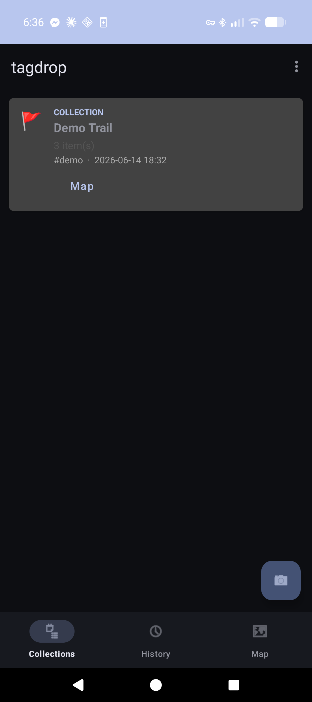
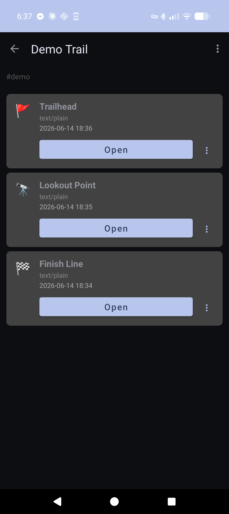
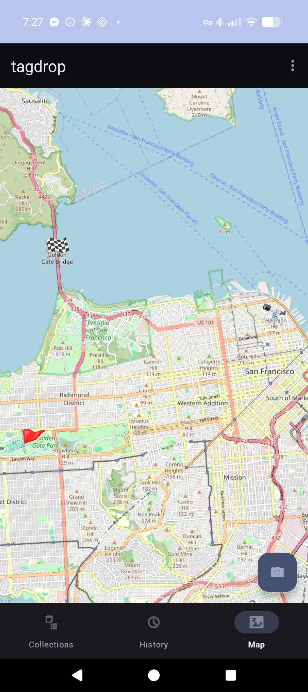
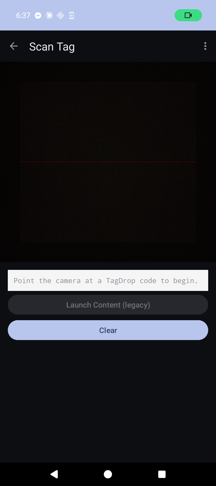
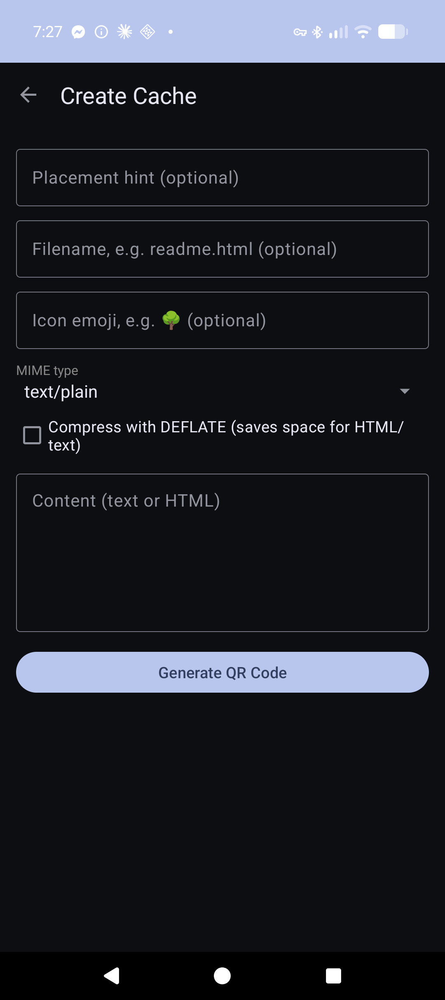
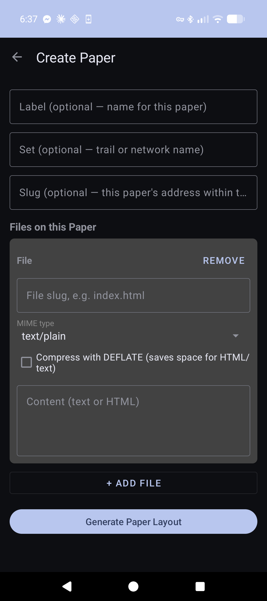

# TagDrop — Tag Dead Drop

TagDrop turns small files — text, HTML pages, images, audio, SVGs — into
self-contained QR codes that work completely offline. Print one on a sticker
or sheet of paper and leave it somewhere; anyone with the TagDrop app (or any
QR scanner that follows `tagdrop:` links) can scan it and view the content
immediately, with no internet connection, server, or account required.

Think of it as a **digital geocache**: instead of a logbook in a box, the
"cache" is the QR code itself.

The name and offline, anonymous, leave-it-in-the-wild spirit are inspired by
[Dead Drops](https://deaddrops.com/) (Aram Bartholl, 2010) — an ongoing
project embedding USB drives in public walls for anonymous offline file
sharing. TagDrop applies the same idea to printed QR codes: no device,
network, or account needed to read or write a drop.

*A real TagDrop code — scan it with the app or the
[web reader](tools/reader/) to read a short "Hello from TagDrop!" message.*

## What you can do with it

- **Drop a single page** — encode text, an HTML page, an SVG image, or JSON
  into one QR code, either in-app (Create Cache) or with the
  [web generator](tools/generator/).
- **Drop a whole "paper"** — a printable sheet with a directory QR code (a
  *paper manifest*) plus one QR per file, built in-app (Create Paper) or with
  the web generator. Pages can link to each other with ordinary relative
  links or `tagdrop://<root-hash>/<slug>` links, so a small static site
  survives being printed and scanned back in.
- **Spread large content across multiple codes** — split a payload too big
  for one QR into a manifest plus chunk codes placed along a trail. The app
  collects chunks in any order and reassembles and verifies them.
- **Build trails and collections** — link papers together with `related`
  hints (optionally with coordinates), or tag a loose set of stickers with a
  shared `collection_id` so they group into one card on the home screen and
  map, even though each code is independently scannable.
- **Browse offline** — scanned pages render in an in-app WebView. The
  Collections, History, and Map tabs let you revisit, locate, and manage
  everything you've found.

## Screenshots

<table>
  <tr>
    <td align="center">
       
      Collections
    </td>
    <td align="center">
       
      Collection detail
    </td>
    <td align="center">
       
      Map
    </td>
  </tr>
  <tr>
    <td align="center">
       
      Scan
    </td>
    <td align="center">
       
      Create Cache
    </td>
    <td align="center">
       
      Create Paper
    </td>
  </tr>
</table>

## How it works

Every code carries a `tagdrop:<base45-cbor-sequence>` URI — a
[CBOR](https://cbor.io/) sequence (version, type, and payload map),
[Base45](https://www.rfc-editor.org/rfc/rfc9285)-encoded so it packs
efficiently into a QR code's alphanumeric mode. Content can optionally be
DEFLATE-compressed. IDs are content-addressed (SHA-256 based), so identical
content always gets the same ID regardless of who created it.

See [SPEC.md](SPEC.md) for the full wire format and design rationale.

## Tools

- **Android app** (`app/`) — scan with the camera, browse content offline,
  create single-code drops and multi-file paper layouts (with printable QR
  sheets / PDF export), and explore collections, history, and a map of
  located finds.
- **[Web generator](tools/generator/)** — build single codes or full
  multi-file "paper" layouts with a printable QR sheet, entirely in the
  browser, no install needed.
- **[Web reader](tools/reader/)** — decode and preview `tagdrop:` codes in
  any browser.
- **[Examples](tools/examples/)** — pre-rendered sample QR codes for testing
  the app and the web reader.

## Building

See [DEVELOPING.md](DEVELOPING.md) for getting the Android app building and
running from source.

## Status

V2.0 — CBOR-sequence envelope encoding (`tagdrop:<base45>`), paper manifests
with multi-file directories and relative-link navigation, geographic trails
via `related` hints, ad-hoc collections, an in-app scanner with a live scan
board, and a Map tab for located finds.

## Extra

Category: tools

Source: https://github.com/mofosyne/tagdrop

Licence: https://github.com/mofosyne/tagdrop/blob/master/COPYING.txt - GNU GENERAL PUBLIC LICENSE Version 3, 29 June 2007
