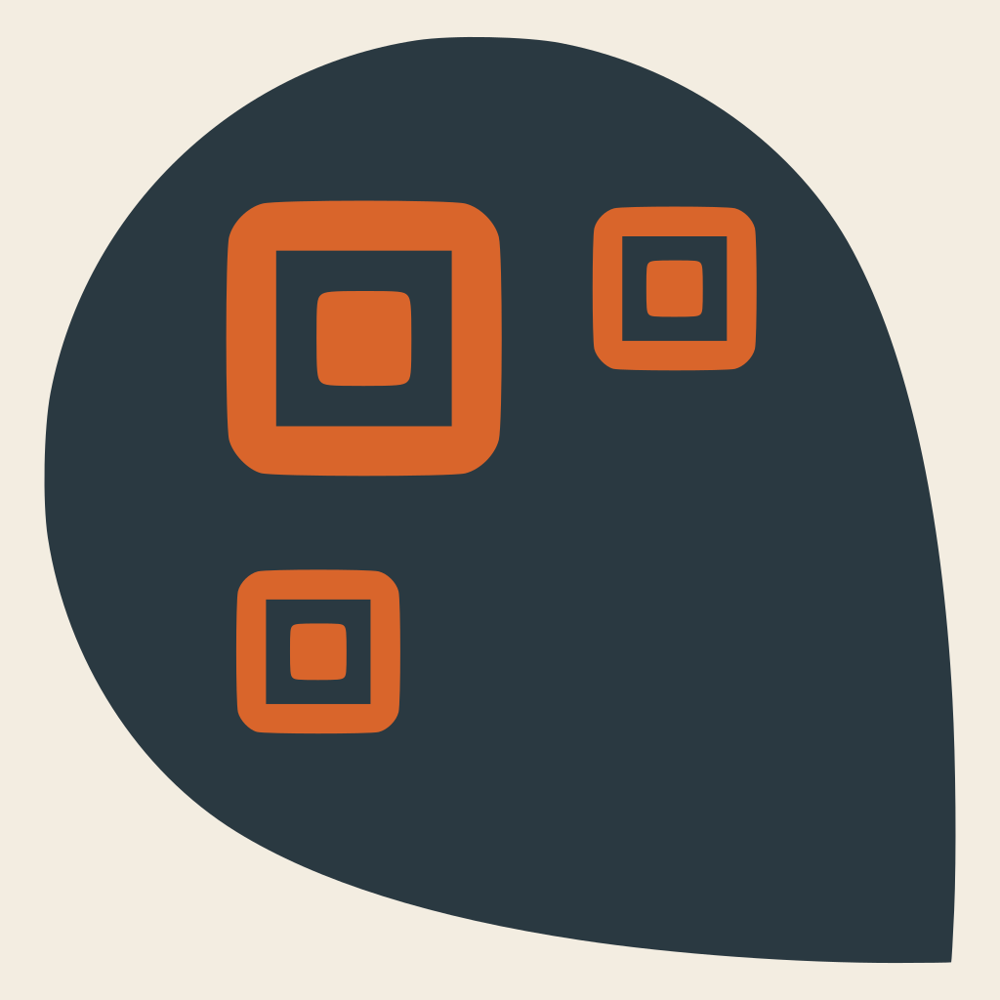
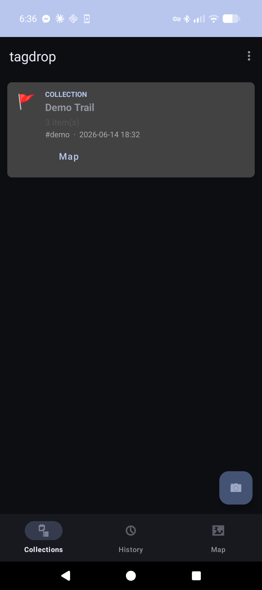
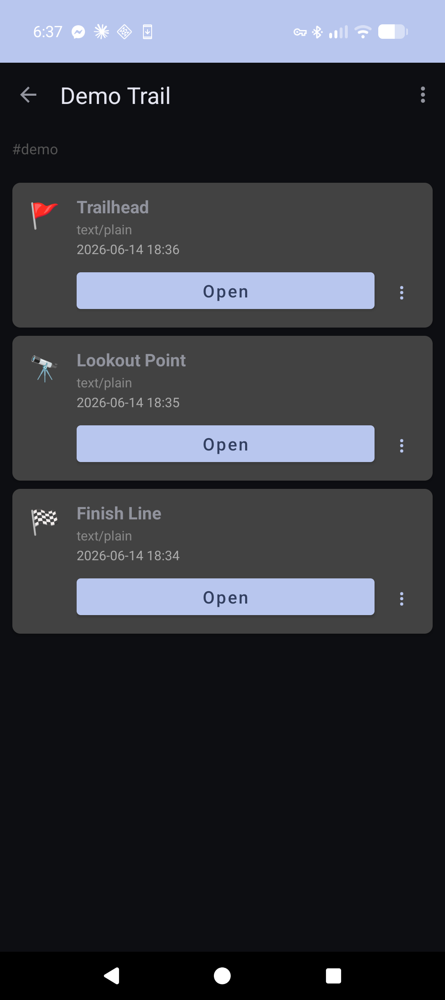
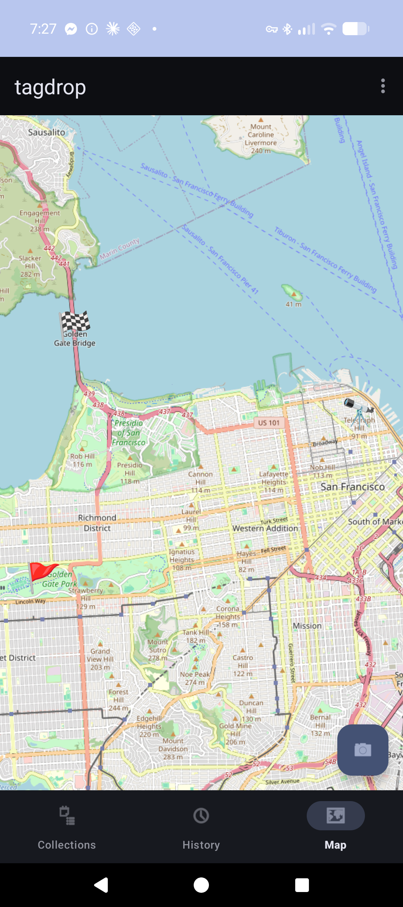
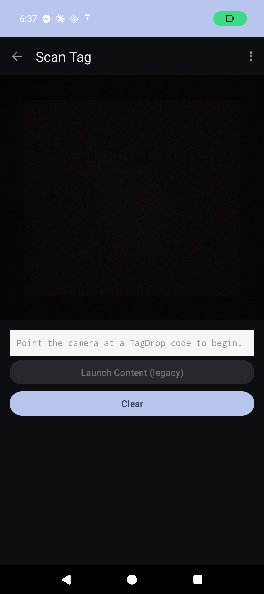
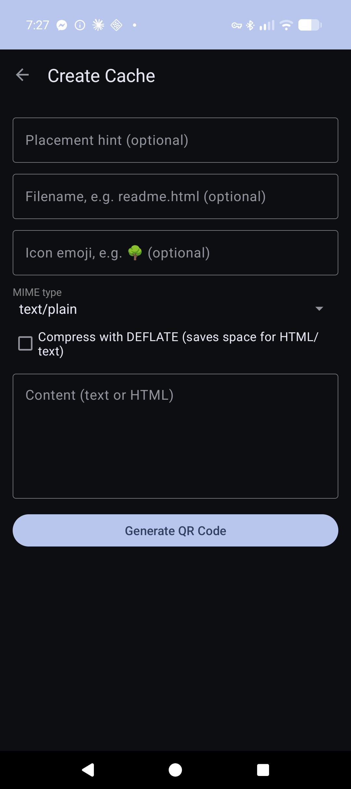
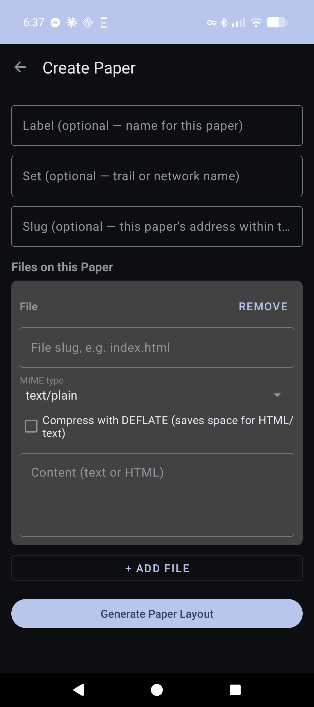

# TagDrop — Tag Dead Drop

<a href="https://f-droid.org/packages/com.github.mofosyne.tagdrop">
    
</a>

**[Main Website For Examples and Generator](https://mofosyne.github.io/tagdrop/)**

TagDrop turns small files — text, HTML pages, images, audio, SVGs — into
self-contained QR codes that work completely offline. Print one on a sticker
or sheet of paper and leave it somewhere; anyone with the TagDrop app (or any
QR scanner that follows `tagdrop:` links) can scan it and view the content
immediately, with no internet connection, server, or account required.

Think of it as a **digital geocache**: instead of a logbook in a box, the
"cache" is the QR code itself. [Geocaching](https://www.geocaching.com/)
(since 2000) was the original inspiration — hide a "cache," let people find
and log it — TagDrop just swaps the physical container and logbook for a
printed code and on-screen content.

The name and offline, anonymous, leave-it-in-the-wild spirit are inspired by
[Dead Drops](https://deaddrops.com/) (Aram Bartholl, 2010) — an ongoing
project embedding USB drives in public walls for anonymous offline file
sharing. TagDrop applies the same idea to printed QR codes: no device,
network, or account needed to read or write a drop.


*A real TagDrop code — scan it with the app or the
[web reader](https://mofosyne.github.io/tagdrop/tools/reader/) to read a short "Hello from TagDrop!" message.*

## What you can do with it

- **Drop a single page** — encode text, an HTML page, an SVG image, or JSON
  into one QR code, either in-app (Create Cache) or with the
  [web generator](https://mofosyne.github.io/tagdrop/tools/generator/).
- **Drop a whole "paper"** — a printable sheet with a directory QR code (a
  *paper manifest*) plus one QR per file, built in-app (Create Paper) or with
  the web generator. Pages can link to each other with ordinary relative
  links or `tagdrop://@<root-hash>/<slug>` links (or `tagdrop://<domain>/<slug>`
  for a human-readable name), so a small static site survives being printed
  and scanned back in.
- **Spread large content across multiple codes** — split a payload too big
  for one QR into multiple sector codes placed along a trail. The app
  collects sectors in any order and reassembles and verifies them, with an
  optional parity code that can recover a single missing sector.
- **Build trails, collections, and replies** — link papers together with
  `related` hints (optionally with coordinates), tag a loose set of stickers
  with a shared `collection_id` so they group into one card on the home
  screen and map, or mark a code as a reply to another to thread a
  conversation across drops — even though each code is independently
  scannable.
- **Hide content behind encryption** — AES-256-GCM encrypted override maps
  let you keep a "cover story" visible while the real content stays locked.
  Unlock with a **key-code QR** (a separate code carrying the AES key) or a
  **passphrase** (PBKDF2-SHA256 key derivation, no second QR needed). Derived
  keys are stored persistently so you only enter a passphrase once per device.
- **Browse offline** — scanned pages render in an in-app viewer, with
  search/`#hashtag` filtering and a hex/CBOR inspector for the curious. The
  Collections, History, and Map tabs let you revisit, locate, and manage
  everything you've found, and a single file can back up or restore it all.
- **Tap instead of scan** — write any TagDrop code to a blank or rewritable
  NFC tag, then read it back with a tap instead of the camera.

## Screenshots

<table>
  <tr>
    <td align="center">
      <br>
      <sub>Collections</sub>
    </td>
    <td align="center">
      <br>
      <sub>Collection detail</sub>
    </td>
    <td align="center">
      <br>
      <sub>Map</sub>
    </td>
  </tr>
  <tr>
    <td align="center">
      <br>
      <sub>Scan</sub>
    </td>
    <td align="center">
      <br>
      <sub>Create Cache</sub>
    </td>
    <td align="center">
      <br>
      <sub>Create Paper</sub>
    </td>
  </tr>
</table>

## How it works

Every code carries a `tagdrop:<base41-cbor-sequence>` URI — a
[CBOR](https://cbor.io/) sequence (version, type, and payload map),
Base41-encoded (a QR/URI-safe alphabet packed like RFC 9285 Base45) so it
packs efficiently into a QR code's alphanumeric mode. Content can optionally be
DEFLATE-compressed. IDs are content-addressed (SHA-256 based), so identical
content always gets the same ID regardless of who created it.

See [SPEC.md](SPEC.md) for the full wire format and design rationale.

## Tools

- **Android app** (`app/`) — scan with the camera, browse content offline,
  create single-code drops and multi-file paper layouts (with printable QR
  sheets / PDF export), and explore collections, history, and a map of
  located finds. Includes a Key Management screen for retained AES keys.
- **[Web generator](https://mofosyne.github.io/tagdrop/tools/generator/)** — build single codes or full
  multi-file "paper" layouts with a printable QR sheet, entirely in the
  browser. Supports both key-code QR and passphrase encryption modes, and
  bulk export of generated codes as a ZIP of PNGs or a printable PDF sheet.
- **[Web reader](https://mofosyne.github.io/tagdrop/tools/reader/)** — decode and preview `tagdrop:` codes in
  any browser, with camera scanning, passphrase prompts, and persistent key
  retention.
- **[Examples](https://mofosyne.github.io/tagdrop/tools/examples/)** — pre-rendered sample QR codes for testing
  the app and the web reader, including passphrase-encrypted and key-code
  encrypted examples.

## Building

See [DEVELOPING.md](DEVELOPING.md) for getting the Android app building and
running from source.

## Status

> ⚠ **Wire format v1 is a draft.** No real-world codes have been printed or distributed yet, so breaking wire-format changes may occur without a version bump. Once the first code is deployed the format freezes.

**TagDrop v2.1** — wire format version 1 (see [SPEC.md](SPEC.md)). CBOR-sequence envelope encoding
(`tagdrop:<base41>`) with content split into one or more sectors plus
optional parity recovery, paper manifests with multi-file directories and
relative-link navigation, geographic trails via `related` hints and located
content, ad-hoc collections, reply threading, an in-app scanner with a live
scan board, NFC tag read/write, search and `#hashtag` filtering, full
backup/restore, and AES-256-GCM encryption via key-code QR or passphrase
(PBKDF2-SHA256).

## Community conventions

These are recommended conventions for placing TagDrop codes in the wild so they
can be discovered and catalogued by others.

### OpenStreetMap tagging

If you embed a TagDrop code at a physical location (sticker, sign, USB dead
drop, geocache, etc.), consider adding it to
[OpenStreetMap](https://www.openstreetmap.org/) so others can find it:

- For a USB dead drop: use `man_made=dead_drop` and add `tagdrop=<uri>` (the
  full `tagdrop:…` URI of the manifest or entry-point code).
- For a standalone sticker/printout: use `tourism=artwork` or another suitable
  primary tag, again with `tagdrop=<uri>`.
- For a geocache-style hide: `leisure=geocache` + `tagdrop=<uri>`.

A future version of the app may query OSM for nodes with a `tagdrop=*` tag to
show nearby drops on the map — tagging your drop now means it will appear
automatically when that feature ships.

### Dead Drops project

[Dead Drops](https://deaddrops.com/) (Aram Bartholl, 2010) is the original
public USB dead-drop project. If your TagDrop code is attached to or near a
registered dead drop, consider:

1. Listing the drop on deaddrops.com (if not already listed).
2. Adding a `tagdrop=<uri>` field to the drop's deaddrops.com entry, if/when
   the site adds support for that field. (We've reached out to suggest this —
   see below.)

We've contacted the deaddrops.com team to suggest adding a **TagDrop URI
field** to their drop database, so the two communities can cross-reference
each other without either app needing to scrape the other's data.

### TagDrop community drop database

The TagDrop project maintains a curated list of known drops at:

```
https://mofosyne.github.io/tagdrop/db/drops.json
```

To list your drop: open a pull request adding an entry to
[`docs/db/drops.json`](docs/db/drops.json) in this repo. The entry needs the
`cache_id` of your TagDrop code (visible in the app's inspect screen or the web
generator), coordinates, and an optional hint.

You can also publish your own drop list at any URL and distribute it as a
`tagdrop:` hint QR — the app will prompt the finder to add it as a source when
they scan the QR (see `source_url`, SPEC.md §17).

## Extra Readings

* [#nfcdab](https://nfcdab.org) : A DIY international and independent digital art biennale in Wroclaw, Poland, that uses wireless technology, light waves and electromagnetic fields e.g.: Wi-Fi routers, QR codes or NFC tags for accessing content with your 📱 smartphone

## Extra

Category: tools

Source: https://github.com/mofosyne/tagdrop

Licence: https://github.com/mofosyne/tagdrop/blob/master/COPYING.txt - GNU GENERAL PUBLIC LICENSE Version 3, 29 June 2007
